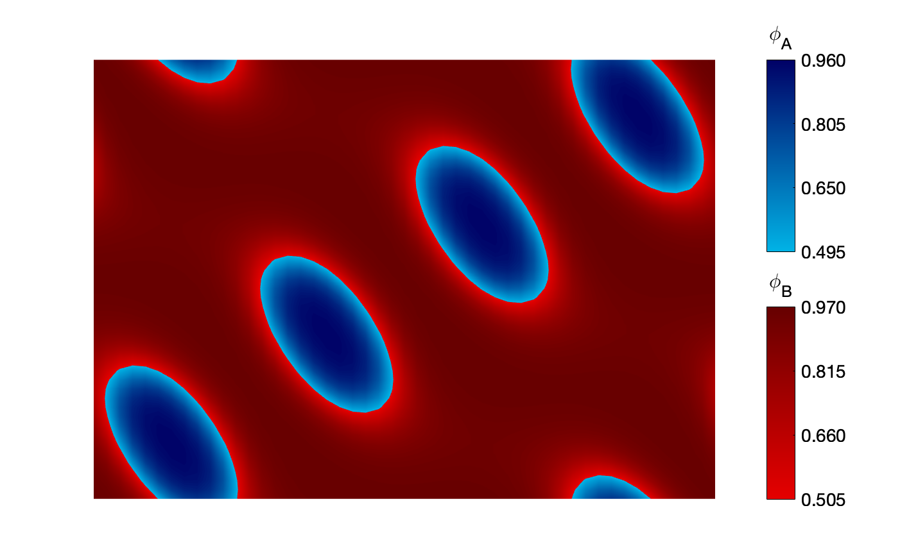

# Polymer Visual

A package of MATLAB functions that generate detailed figures to characterize the structure of self-assembled polymeric systems, using data calculated by the [open-source software package PSCF](https://pscf-home.cems.umn.edu/). 

The original MATLAB code was written by Naveen Pillai, with help from Akash Arora. This expanded version was created by Ben Magruder. The Voronoi cell visualization on the 2D contour plots was developed by Ryan Collanton. All of this work was done at the University of Minnesota &ndash; Twin Cities, in the research group of Dr. Kevin Dorfman. 
<br> <br>

# Contents

- [Overview and Examples](#overview-and-examples)
- [Installation](#installation)
- [Basic Usage](#basic-usage)
  * [Individual Composition Profiles](#individual-composition-profiles)
  * [Composite Composition Profiles](#composite-composition-profiles)
  * [1D Line Profiles](#1d-line-profiles)
  * [2D Contour Plots](#2d-contour-plots)
  * [Scattering Plots](#scattering-plots)
  * [Generating All Possible Plots](#generating-all-possible-plots)
- [Advanced Usage](#advanced-usage)
  * [Bash Terminal Command Line Usage](#bash-terminal-command-line-usage)
  * [Thin Film Correction](#thin-film-correction)
- [Development](#development)
  * [Using Git](#using-git)

<br> <br>

# Overview and Examples

Polymer Visual is a package of MATLAB functions that was developed as a companion to the self-consistent field theory (SCFT) software [PSCF](https://pscf-home.cems.umn.edu/), to visualize the solutions that are output at the end of an SCFT calculation. Polymer Visual is compatible with both the C++ and Fortran versions of PSCF. 

SCFT is a mean-field theory that is derived from polymer statistical mechanics, allowing for accurate estimates to be calculated of the morphology and energetics of self-assembled polymer systems, including block polymers, blends, and solutions. More detail about SCFT can be found in PSCF's [companion publication](https://pubs.acs.org/doi/10.1021/acs.macromol.6b00107) in *Macromolecules*. 

From the standpoint of Polymer Visual, the SCFT output of interest is the real-space composition profile of the polymer system. This is a 1D, 2D, or 3D profile on a discretized mesh of evenly spaced gridpoints in a unit cell, where a periodic boundary condition exists at each face of the unit cell. At each gridpoint, the volume fraction of each monomer and each solvent species is given, such that the sum of the volume fractions of all species is equal to 1. PSCF stores these data in an "rgrid" (Fortran) or "rf" (C++) file, and the goal of Polymer Visual is to generate 3D figures to visualize the data. Examples for a double-gyroid morphology are given below.

<br>

<p align="center">

 <br>
<font size="-1" align="center"><b>Fig. 1:</b> Density profiles generated with Polymer Visual showing a double-gyroid morphology, with numerically accurate colorbars.</font>
</p>

<br>

Users can also add opacity, lighting, and other customizations in order to make the figures more visually informative:

<br>

<p align = "center">

 <br>
<font size="-1" align="center"><b>Fig. 2:</b> Density profiles showing the same data as the profiles in Fig. 1, but with customized lighting and opacity.</font>
</p>

<br>

In addition to creating 3D visualizations, Polymer Visual can plot 1D line profiles along any user-defined line through the unit cell, as well as 2D contour plots on any user-defined plane cutting through the unit cell. Examples below are shown for the same double-gyroid structure as Figs. 1 and 2.

<br>

<p align = "center">

 <br>
<font size="-1" align="center"><b>Fig. 3:</b> A 1D line profile showing the change in species composition along the [111] direction through the double-gyroid unit cell, and a 2D contour plot showing the composition profile on the (1-10) plane (the plane containing [110] and [001]). This contour plot has alternative colorbar locations, which can be achieved for any figure with multiple colorbars using the "cb_rows" input. </font>
</p>

<br>

Finally, Polymer Visual can use the 3D composition profiles to predict the scattering peak intensities of the structure, assuming that the scattering volume of the sample has many grains that are randomly oriented. The predicted scattering profile of the double-gyroid is shown below.

<br>

<p align = "center">
 <br>
<font size="-1" align="center"><b>Fig. 4:</b> The predicted scattering profile of a multi-grain, randomly oriented sample of the double-gyroid structure of Figs. 1-3.</font>
</p>

<br> <br>

# Installation

This software package is entirely written in MATLAB, so users must have an active MATLAB license and must have the MATLAB software installed locally. MATLAB 2019b is the oldest version that is expected to be compatible with the code, although the writing and testing of the code was primarily performed using MATLAB 2021b and 2022a. 

The package is hosted on GitHub [here](https://github.com/kdorfmanUMN/polymer_visual). Users have two options for obtaining the code:

1. Download the entire package as a .zip file from the GitHub page (click the "Code" icon, then click "Download ZIP" from the drop-down menu) **(recommended for casual users)**
2. Clone the package using a git version control client at the command line **(recommended for any user who wants to contribute to development on this project, or easily keep up-to-date on new versions of the code)**:
	* From the terminal, navigate to the destination in your file tree where you would like to store the polymer\_visual directory using `cd /path/to/destination/`
	* Enter the command `git clone https://github.com/kdorfmanUMN/polymer_visual.git`
	* A new directory, polymer\_visual, will be downloaded and will contain all of the polymer\_visual code.

Users who install the software using a git client can call `git pull` from the polymer\_visual directory at any time to update their version of the code to the most up-to-date version on the GitHub repository. More advanced version control features available with git can be learned using a variety of online resources, including the [git user manual](https://git-scm.com/docs/user-manual). For those who wish to contribute to the code, a brief overview of the useful features of git can be found in the [Development](#development) section. 

<br> <br>

# Basic Usage

Polymer Visual was written for a very specific type of usage: any possible plot that the user might want to create can (ideally) be generated by a single function call from the MATLAB Command Window. This is implemented through a large number of allowed name-value pair inputs that can be passed to the functions, each of which customizes the resulting figure in a particular way. For example, the composite density profile in [Fig. 1](#overview-and-examples) was generated by the following function call, which does not contain name-value pair inputs and thus represents the default behavior:

```matlab
composite_profile('examples/gyr.rgrid')
```

By contrast, the profile in [Fig. 2](#overview-and-examples) was generated using

```matlab
composite_profile('examples/gyr.rgrid', 'light', true, 'hide_axes', true, 'opacity', [1,0;1,0.5])
```

As is evident from these function calls, the only necessary input to `composite_profile` is a path to the file that contains the data you wish to plot, in PSCF r-grid format. This same type of usage can be applied to some of the other functions in this package, namely `individual_profiles(filename)` and `scattering_plot(filename)` that generate individual density profiles and the predicted scattering peak intensities, respectively. 

The functions `line_profile(filename, direc)` and `contour_plot(filename, contourvecs)` generate figures like those shown in [Fig. 3](#overview-and-examples), and they require an additional input parameter that specifies either the line or the plane through the unit cell that should be plotted, respectively.

Finally, users can call `polymer_visual(filename)` to generate all possible plots, which requires only the filename as an input.

In addition to a filename input, all of the functions in Polymer Visual can instead directly accept the matrices containing the data that are needed to generate the plot. For example, the composite density profile in [Fig. 1](#overview-and-examples) can be generated with the following call:

```matlab
composite_profile(R,x,y,z,dim)
```

where R, x, y, z, and dim contain all of the data necessary to create the plot (more detail on these inputs is given in the sections below). This way, a script that calls multiple of these Polymer Visual functions for the same data set (like the `polymer_visual` script) does not need to read in the data from the file multiple times, and can instead pass the data directly into each of the functions. 

The remainder of this section describes each function in Polymer Visual individually, giving a description of all possible inputs that can be accepted by the functions.

<br> <br>

## Individual Composition Profiles

The function `individual_profiles` will draw a 3D density profile for each species in the system, like the A block density profiles shown in Figs. [1 and 2](#overview-and-examples).

|Syntax|Description|
|---|---|
|`individual_profiles(filename)` | Plot one 3D density profile for each species in the system described by the r-grid file indicated by filename.|
|`individual_profiles(R,x,y,z,dim)` | Plot one 3D density profile for each species in the system described by the 4-dimensional matrix R. Matrices x, y, and z contain the x, y, and z coordinates of the gridpoints, and dim is a scalar indicating the dimensionality of the original calculation in PSCF (either 1, 2, or 3). All 5 inputs are required.|
|`individual_profiles(____,Name,Value)` | Specify the name-value arguments after all the arguments in either of the previous syntaxes.|

### Input Arguments:

|Input|Description|
|---|---|
|`filename`|Path to r-grid file containing the data to be plotted. Can be either an absolute or relative path.|
|`R`|4-dimensional matrix containing the composition of each species at each gridpoint. If the mesh dimensions are X by Y by Z, and there are N species in the system, then the size of `R` should be (X,Y,Z,N). `R(i,j,k,n)` corresponds to the volume fraction of species n at gridpoint (i,j,k).|
|`x`|3-dimensional matrix containing the x-coordinate of each gridpoint. If the mesh dimensions are X by Y by Z, then the size of `x` should be (X,Y,Z). `x(i,j,k)` corresponds to the x-coordinate of gridpoint (i,j,k).|
|`y`|Identical to `x` except containing the y-coordinates.|
|`z`|Identical to `x` except containing the z-coordinates.|
|`dim`|Scalar indicating the dimensionality of the original calculation in PSCF (either 1, 2, or 3).|

### Name-Value Pair Arguments:

|Name|Description|
|---|---|
|`savefile`| A filename to which the figures will be saved. The file extension provided (e.g. ".fig" or ".png") will be used to determine the type of file to save. Since this function typically generates more than 1 figure, we append mono_label(j) to the end of the filename when saving the composition profile for species j. If left empty (which is the default behavior), the figures are not saved.|
|`resolution`| A number that specifies the resolution of the figure that is saved (if savefile is specified), in dots per inch (dpi). Default value is 300. If set to 0, file is saved at screen resolution.|
|`fontsize`| Specifies the FontSize parameter for the axis on which data are plotted. Default value is 14.|
|`hex3`| A boolean indicating whether to plot 3 unit cells for a hexagonal system (in the shape of a hexagon) rather than 1. Should only be true if the lattice system is hexagonal. Default value is false.|
|`light`| A boolean indicating whether to insert a "light" object into the plot. This adds shadows that can make 3D structure clearer (see [Fig. 2](#overview-and-examples)), but invalidates the accuracy of the colorbar. Default value is false.|
|`view`| A 1, 2, or 3-element vector that specifies the viewing angle of the figure(s). If this is included, it is stored in options.view and we call view(options.view) to set the viewing angle, so options.view must be something that complies with the view() function. If the input is 2 or 3 (scalar values), the view will be the default 2D or 3D view, respectively. If the input is a 2-element vector, the two elements correspond to the azimuth and elevation angles, respectively. If view is a 3-element vector, the values represent a vector that points from the origin to the viewer. Default value is 3.|
|`hide_axes`| A boolean indicating whether to hide the axes on the plot. If set to true, the plot will not contain the tick marks, title, etc. by setting the "visible" property of the axes to "off". Default value is false.|
|`isovalue`| An array of isovalues representing the minimum volume fraction to show on plot. Each element in the isovalue array corresponds to one species, such that isovalue(j) is the isovalue for the species described by the data R(:,:,:,j). If not specified, we call utilities/get_isovalues.m to calculate them automatically.|
|`mono_label`| An array containing string labels for each monomer species. If not specified, we use ["A","B","C",...] as the default behavior.|
|`opacity`| An array containing values of opacity to plot for each species. 2 opacities are specified for each species j: opacity(1,j) is the opacity of the interior of the domains, while opacity(2,j) is the opacity of the exterior (caps) of the domains. If unspecified, all values default to 1 (completely opaque). See the composite density profile in [Fig. 2](#overview-and-examples) for an example of this, in which opacity = [1,0;1,0.5].|
|`map`| A cell array containing a colormap for each species. map{j} is the colormap for species j. If unspecified, we use the default colormaps generated by utilities/get_colormaps.m.|
|`thick`| A scalar specifying the value for "linethickness" used to draw the outer box of the unit cell. Default value is 1.|
|`box_color`| A [string or RGB triplet](https://www.mathworks.com/help/matlab/creating_plots/specify-plot-colors.html) specifying the value for "color" used to draw the outer box of the unit cell. Default color is gray ([0.5,0.5,0.5]).|
|`alim`| A two-element vector containing the lower and upper limits along the direction of the **a** lattice vector of the volume that you wish to show on the composition profiles, in reduced coordinates. The default value, [0,1], indicates a single unit cell will be shown, but alternate arrays can be used to generate a figure containing multiple unit cells and/or partial unit cells.|
|`blim`| The same as `alim`, but along the direction of the **b** lattice basis vector.|
|`clim`| The same as `alim`, but along the direction of the **c** lattice basis vector.|
|`cb_ticks`| A scalar specifying the number of ticks to show on each colorbar. Default value is 10.|
|`n_digits`| A scalar or vector specifying the number of digits past the decimal point to use for the colorbar tick labels. Can be specified as a scalar, or as an array of length n_mnr (one value per monomer species plotted) if you want a different # of digits for each colorbar. Default value is 3.|
|`substrate`| A boolean specifying whether to add a thin 3D substrate onto the figure underneath the polymer unit cell (default is false). The substrate is 5% bigger than the unit cell in the x and y direction, and has a thickness of 5% of the unit cell's z dimension. Aesthetic properties of the substrate are modifiable by the additional inputs below.|
|`substrate_color`| A [string or RGB triplet](https://www.mathworks.com/help/matlab/creating_plots/specify-plot-colors.html) specifying the value for "FaceColor" used for the substrate. Default color is gray ([0.5,0.5,0.5]).|
|`substrate_line_color`| A [string or RGB triplet](https://www.mathworks.com/help/matlab/creating_plots/specify-plot-colors.html) specifying the value for "EdgeColor" used for the substrate. Default color is black ("k").|
|`substrate_line_width`| A number specifying the value for "LineWidth" used when drawing the substrate. Default value is 1.|
|`top_wall`| A boolean specifying whether to add a thin 3D substrate onto the figure on top of the polymer unit cell (default is false). The top wall is 5% bigger than the unit cell in the x and y direction, and has a thickness of 5% of the unit cell's z dimension. Aesthetic properties of the top wall are modifiable by the additional inputs below.|
|`top_wall_color`| A [string or RGB triplet](https://www.mathworks.com/help/matlab/creating_plots/specify-plot-colors.html) specifying the value for "FaceColor" used for the top wall. If unspecified, the value will be set to be identical to `substrate_color` by default.|
|`top_wall_line_color`| A [string or RGB triplet](https://www.mathworks.com/help/matlab/creating_plots/specify-plot-colors.html) specifying the value for "EdgeColor" used for the top wall. If unspecified, the value will be set to be identical to `substrate_line_color` by default.|
|`top_wall_line_width`| A number specifying the value for "LineWidth" used when drawing the top wall. If unspecified, the value will be set to be identical to `substrate_line_width` by default.|
|`film_params`| If your SCFT result is a thin film, you should include film\_params as an input to apply a thin film correction. See the [Thin Film Correction](#thin-film-correction) section below for a description of this correction. <br> <br> film\_params is an array with 4 entries. The first 3 entries correspond to the 3 required parameters in pscfpp that are needed to define a Wall object: normalVec, interfaceThickness, and wallThickness. See [pscfpp](https://github.com/dmorse/pscfpp) documentation for details about what each of these three parameters means. The fourth entry is a boolean (i.e. 0 for false, 1 for true) that indicates whether or not to rotate the figure to make the z axis orthogonal to the wall. If this film_params input is included, the code will apply a correction to the plot to make the figure look good as a thin film. If it is not included, it is assumed that the data being plotted are not under a thin film constraint, or that any correction has already been applied.|

<br> <br>

## Composite Composition Profiles

The function `composite_profile` will draw a 3D density profile for all species in the system on the same axes, like the composite density profiles shown in Figs. [1 and 2](#overview-and-examples).

|Syntax|Description|
|---|---|
|`composite_profile(filename)` | Plot a 3D density profile showing all species in the system on the same axes, for the system described by the r-grid file indicated by filename.|
|`composite_profile(R,x,y,z,dim)` | Plot a 3D density profile showing all species in the system on the same axes, for the system described by the 4-dimensional matrix R. Matrices x, y, and z contain the x, y, and z coordinates of the gridpoints, and dim is a scalar indicating the dimensionality of the original calculation in PSCF (either 1, 2, or 3). All 5 inputs are required.|
|`composite_profile(____,Name,Value)` | Specify the name-value arguments after all the arguments in either of the previous syntaxes.|

### Input Arguments:

Identical to the input arguments for `individual_profiles` [described above](#individual-composition-profiles).

### Name-Value Pair Arguments:

All name-value pair arguments that are used for `individual_profiles` [described above](#individual-composition-profiles) can also be used with `composite_profile`. The following additional name-value pair arguments are specific to `composite_profile`:

|Name|Description|
|---|---|
|`species`| A vector that contains the indices for each monomer species to plot, allowing users to plot *some* but not *all* species in the composite profile. For example, if the data set contains 4 species but only the first and third should be plotted, species = [1,3]. The default behavior is to plot all species.|
|`cb_rows`| A scalar specifying the number of rows of colorbars that are shown on the figure. For example, if there are 8 colorbars on the figure, cb_rows = 2 will result in a 2x4 grid of colorbars being shown on the figure, as opposed to the default 1x8 grid. Default value is 1.|

<br> <br>

## 1D Line Profiles

The function `line_profile` will plot the compositions of each species along any line through the unit cell specified by the user (as long as there are gridpoints somewhere along this line). An example is shown in [Fig. 4](#overview-and-examples). 

|Syntax|Description|
|---|---|
|`line_profile(filename,direc)` | Plot the composition profile of all species along a vector specified by direc, starting from the origin, for the system described by the r-grid file indicated by filename.|
|`line_profile(filename,direc,startloc)` | Plot the composition profile of all species along a vector specified by direc, starting from the position specified by startloc, for the system described by the r-grid file indicated by filename.|
|`line_profile(R,direc)` | Plot the composition profile of all species along a vector specified by direc, starting from the origin, for the system described by the 4-dimensional matrix R.|
|`line_profile(R,direc,startloc)` | Plot the composition profile of all species along a vector specified by direc, starting from the position specified by startloc, for the system described by the 4-dimensional matrix R.|
|`line_profile(____,Name,Value)` | Specify the name-value arguments after all the arguments in any of the previous syntaxes.|

### Input Arguments:

|Input|Description|
|---|---|
|`filename`| Path to r-grid file containing the data to be plotted. Can be either an absolute or relative path.|
|`R`| 4-dimensional matrix containing the composition of each species at each gridpoint. If the mesh dimensions are X by Y by Z, and there are N species in the system, then the size of `R` should be (X,Y,Z,N). `R(i,j,k,n)` corresponds to the volume fraction of species n at gridpoint (i,j,k).|
|`direc`| A vector specifying the direction of the line along which the composition profile is traced, **in reduced coordinates** (e.g., [1,1,1] traces along the body diagonal). This is a required input. Can be either a 1D, 2D, or 3D vector. If 1D, the profile will be traced along the x-axis only. If 2D, the profile will be traced in the x-y plane. If 3D, the profile will be traced along the actual 3D vector in the unit cell. The length of the vector direc also defines the length of the line along which the profile is traced.|
|`startloc`| A vector specifying the starting location of the line profile **in reduced coordinates** (e.g., [0.5,0.5,0.5] is the center of the unit cell). This is an optional input; if it is omitted, the origin is used as the starting location. Must have the same dimensionality as `direc`. The line profile will be traced along a line from `startloc` to `startloc+direc`.|

### Name-Value Pair Arguments:

|Name|Description|
|---|---|
|`savefile`| A filename to which the figures will be saved. The file extension provided (e.g. ".fig" or ".png") will be used to determine the type of file to save.|
|`resolution`| A number that specifies the resolution of the figure that is saved (if savefile is specified), in dots per inch (dpi). Default value is 300. If set to 0, file is saved at screen resolution.|
|`fontsize`| Specifies the FontSize parameter for the axis on which data are plotted. Default value is 14.|
|`mono_label`| An array containing string labels for each monomer species. If not specified, we use ["A","B","C",...] as the default behavior.|
|`colors`| A matrix specifying the color of each line. colors[j,:] is an RGB triplet that is the color for the line profile of species j. The default values correspond to the default colors given in utilities/get_colormaps.|
|`film_params`| If your SCFT result is a thin film, you should include film\_params as an input to apply a thin film correction. See the [Thin Film Correction](#thin-film-correction) section below for a description of this correction. **NOTE: if you include film\_params, you may also need to include coords; see below.** <br> <br> film\_params is an array with 4 entries. The first 3 entries correspond to the 3 required parameters in pscfpp that are needed to define a Wall object: normalVec, interfaceThickness, and wallThickness. See [pscfpp](https://github.com/dmorse/pscfpp) documentation for details about what each of these three parameters means. The fourth entry is a boolean (i.e. 0 for false, 1 for true) that indicates whether or not to rotate the figure to make the z axis orthogonal to the wall. If this film_params input is included, the code will apply a correction to the plot to make the figure look good as a thin film. If it is not included, it is assumed that the data being plotted are not under a thin film constraint, or that any correction has already been applied.|
|`coords`| You must provide coords as an input if the following are both true: <ol> <li> The first input to this function is a data array (R, as opposed to a filename string), and </li> <li> You wish to apply a thin film correction. </li> </ol> Coords is merely a cell array containing the x, y, and z arrays that are produced by utilities/read\_rgrid.m (so, coords = {x, y, z}). These x, y, and z arrays are also the same arrays that are required by `individual_profiles` and `composite_profile` described [above](#individual-composition-profile). These coordinates are required inputs for thin\_film\_correction.m, so we must have them available if we wish to apply the correction.|

<br> <br>

## 2D Contour Plots

The function `contour_plot` plots a 2D density profile of all species at points on a plane through the unit cell, where the plane is specified by the user. It is essentially taking a "slice" of the 3D density profile generated by `composite_profile` and turning it into a 2D plot. 

|Syntax|Description|
|---|---|
|`contour_plot(filename,contourvecs)` | Plot the 2D contour plot of all species along a plane specified by contourvecs, for the system described by the r-grid file indicated by filename.|
|`contour_plot(R,contourvecs,basis)` | Plot the 2D contour plot of all species along a plane specified by contourvecs, for the system described by the 4-dimensional matrix R and the lattice basis vectors stored in basis.|
|`contour_plot(____,Name,Value)` | Specify the name-value arguments after all the arguments in any of the previous syntaxes.|

### Input Arguments:

|Input|Description|
|---|---|
|`filename`| Path to r-grid file containing the data to be plotted. Can be either an absolute or relative path.|
|`R`| 4-dimensional matrix containing the composition of each species at each gridpoint. If the mesh dimensions are X by Y by Z, and there are N species in the system, then the size of `R` should be (X,Y,Z,N). `R(i,j,k,n)` corresponds to the volume fraction of species n at gridpoint (i,j,k).|
|`contourvecs`| A 3x3 matrix that specifies the plane under consideration. The first row is a vector **in reduced coordinates** that points to the starting location, which will be the lower-left corner of the contour plot. This point must be on a gridpoint. The second row is a vector **in reduced coordinates** that specifies the line (direction *and magnitude*) that will become the x-axis of the contour plot. The third row is a vector **in reduced coordinates** that specifies the line that will become the y-axis of the contour plot. <br> <br> So, for example, contourvecs = [0.5,0.5,0.5; 2,0,0; 0,0,1] denotes a plane where the lower left corner is at (0.5,0.5,0.5), the lower right corner is at (2.5,0.5,0.5), and the upper left corner is at (0.5,0.5,1.5) (all in reduced coordinates).|
|`basis`| A 3x3 matrix where the three rows are the three lattice basis vectors that define the unit cell for the data stored in R (see utilities/get_basis.m).|

### Name-Value Pair Arguments:

|Name|Description|
|---|---|
|`savefile`| A filename to which the figures will be saved. The file extension provided (e.g. ".fig" or ".png") will be used to determine the type of file to save.|
|`resolution`| A number that specifies the resolution of the figure that is saved (if savefile is specified), in dots per inch (dpi). Default value is 300. If set to 0, file is saved at screen resolution.|
|`fontsize`| Specifies the FontSize parameter for the axis on which data are plotted. Default value is 14.|
|`mono_label`| An array containing string labels for each monomer species. If not specified, we use ["A","B","C",...] as the default behavior.|
|`map`| A cell array containing a colormap for each species. map{j} is the colormap for species j. If unspecified, we use the default colormaps generated by utilities/get_colormaps.m.|
|`isovalue`| An array of isovalues representing the minimum volume fraction to show on plot. Each element in the isovalue array corresponds to one species, such that isovalue(j) is the isovalue for the species described by the data R(:,:,:,j). If not specified, we call utilities/get_isovalues.m to calculate them automatically.|
|`cb_ticks`| A scalar specifying the number of ticks to show on each colorbar. Default value is 10.|
|`cb_rows`| A scalar specifying the number of rows of colorbars that are shown on the figure. For example, if there are 8 colorbars on the figure, cb_rows = 2 will result in a 2x4 grid of colorbars being shown on the figure, as opposed to the default 1x8 grid. Default value is 1.|
|`n_digits`| A scalar or vector specifying the number of digits past the decimal point to use for the colorbar tick labels. Can be specified as a scalar, or as an array of length n_mnr (one value per monomer species plotted) if you want a different # of digits for each colorbar. Default value is 3.|
|`phase`| A string indicating what the phase is that is being plotted. This input will activate the Voronoi cell feature of `contour_plot`, which, for particle phases like the Frank-Kasper phases, will draw lines on the contour plot representing the Voronoi partition between the particle sites. The particle sites for certain phases (bcc, fcc, a15, c14, c15, sigma, z) are hard-coded in utilities/get\_atomloc.m, and these are the only allowed values for `phase` at this point. New particle phases can be added to get\_atomloc if their Voronoi partition is a desired feature of the contour plot. This Voronoi cell feature is not rigorously tested for effectiveness/correctness at this time.|
|`film_params`| If your SCFT result is a thin film, you should include film\_params as an input to apply a thin film correction. See the [Thin Film Correction](#thin-film-correction) section below for a description of this correction. **NOTE: if you include film\_params, you may also need to include coords; see below.** <br> <br> film\_params is an array with 4 entries. The first 3 entries correspond to the 3 required parameters in pscfpp that are needed to define a Wall object: normalVec, interfaceThickness, and wallThickness. See [pscfpp](https://github.com/dmorse/pscfpp) documentation for details about what each of these three parameters means. The fourth entry is a boolean (i.e. 0 for false, 1 for true) that indicates whether or not to rotate the figure to make the z axis orthogonal to the wall. If this film_params input is included, the code will apply a correction to the plot to make the figure look good as a thin film. If it is not included, it is assumed that the data being plotted are not under a thin film constraint, or that any correction has already been applied.|
|`coords`| You must provide coords as an input if the following are both true: <ol> <li> The first input to this function is a data array (R, as opposed to a filename string), and </li> <li> You wish to apply a thin film correction. </li> </ol> Coords is merely a cell array containing the x, y, and z arrays that are produced by utilities/read\_rgrid.m (so, coords = {x, y, z}). These x, y, and z arrays are also the same arrays that are required by `individual_profiles` and `composite_profile` described [above](#individual-composition-profile). These coordinates are required inputs for thin\_film\_correction.m, so we must have them available if we wish to apply the correction.|

<br> <br>

## Scattering Plots

The function `scattering_plot` plots the predicted scattering peak intensities for a multi-grain, randomly oriented sample of the structure represented by the data. It does this by simply taking the Fourier Transform of the real-space data for a certain monomer species (or set of monomer species) that are denoted as the "scattering species," and plotting the peaks of the FT as a function of the scattering vector length q, alongside their corresponding Miller indices.

|Syntax|Description|
|---|---|
|`scattering_plot(filename)` | Plot a 3D density profile showing all species in the system on the same axes, for the system described by the r-grid file indicated by filename.|
|`scattering_plot(R,x,y,z)` | Plot a 3D density profile showing all species in the system on the same axes, for the system described by the 4-dimensional matrix R. Matrices x, y, and z contain the x, y, and z coordinates of the gridpoints.|
|`scattering_plot(____,Name,Value)` | Specify the name-value arguments after all the arguments in any of the previous syntaxes.|

### Input Arguments:

|Input|Description|
|---|---|
|`filename`|Path to r-grid file containing the data to be plotted. Can be either an absolute or relative path.|
|`R`|4-dimensional matrix containing the composition of each species at each gridpoint. If the mesh dimensions are X by Y by Z, and there are N species in the system, then the size of `R` should be (X,Y,Z,N). `R(i,j,k,n)` corresponds to the volume fraction of species n at gridpoint (i,j,k).|
|`x`|3-dimensional matrix containing the x-coordinate of each gridpoint. If the mesh dimensions are X by Y by Z, then the size of `x` should be (X,Y,Z). `x(i,j,k)` corresponds to the x-coordinate of gridpoint (i,j,k).|
|`y`|Identical to `x` except containing the y-coordinates.|
|`z`|Identical to `x` except containing the z-coordinates.|

### Name-Value Pair Arguments:

|Name|Description|
|---|---|
|`scatterers`|Vector containing the index of each species that is to be considered a "scattering species" (i.e., each species that exhibits scattering contrast with the species that aren't included in this array). If species 3 is the only scattering species, then scatterers = 3. If species 1 and 3 are both considered scattering species, then scatterers = [1,3]. Default value is 1 (only the first species is a scattering species). If there are only two components in the system, the scattering profile will be identical regardless of whether scatterers = 1 or 2.|
|`savefile`| A filename to which the figures will be saved. The file extension provided (e.g. ".fig" or ".png") will be used to determine the type of file to save.|
|`resolution`| A number that specifies the resolution of the figure that is saved (if savefile is specified), in dots per inch (dpi). Default value is 300. If set to 0, file is saved at screen resolution.|
|`writefile`| A filename to which the scattering data (peak intensities for each hkl value) can be written as text. This is useful if you want to do further analyses of the data.|
|`hkls`| An array in which each row contains the hkl indices of one scattering peak to include on the plot (if it is an actual peak). If hkl is not provided, the code below generates this array to include all values of h, k, and l that are 5 or lower. Peaks not included in this array will not be plotted.|
|`fontsize`| Specifies the FontSize parameter for the axis on which data are plotted. Default value is 14.|
|`theta_plot`| A boolean, where we plot our scattering peaks as a function of 2θ if it is true. Otherwise, if false, we plot the data as a function of q (the default).|
|`units`| A string that represents the units of length used in defining x, y, and z. This will be used in the x-axis label of the plot, if provided. So, if units = 'Å', the x-axis label will read 'q [Å^{-1}]'. If not provided, the axis label will just read 'q'.|
|`no_labels`| A boolean which, if true, will suppress the hkl indices from being shown on the plot. Default is false (show all hkl indices for each peak).|
|`film_params`| If your SCFT result is a thin film, you should include film\_params as an input to apply a thin film correction. See the [Thin Film Correction](#thin-film-correction) section below for a description of this correction. <br> <br> film\_params is an array with 4 entries. The first 3 entries correspond to the 3 required parameters in pscfpp that are needed to define a Wall object: normalVec, interfaceThickness, and wallThickness. See [pscfpp](https://github.com/dmorse/pscfpp) documentation for details about what each of these three parameters means. The fourth entry is a boolean (i.e. 0 for false, 1 for true) that indicates whether or not to rotate the figure to make the z axis orthogonal to the wall. If this film_params input is included, the code will apply a correction to the plot to make the figure look good as a thin film. If it is not included, it is assumed that the data being plotted are not under a thin film constraint, or that any correction has already been applied.|

<br> <br>

## Generating All Possible Plots

To generate all plots for a given r-grid file (individual density profiles, a composite density profile, a line profile, a contour plot, and a scattering peak intensity profile), users can call `polymer_visual(filename, ____)` with as many name-value pair options as desired in the `____` slot. Any of the name-value pair options that are available for any of the functions listed above are also available as name-value pair inputs for `polymer_visual`. For example, `'light'` is a name-value pair input that is available for `individual_profiles` and `composite_profile`, so passing this name-value pair into `polymer_visual` will subsequently pass that input into both of the two functions that can use that input. 

If `savefile` is specified as a name-value pair input, the figures will all be saved with slight modifications to the filename specified by the input string to make them all distinct files. 

Furthermore, `polymer_visual` does not require `direc` and `contourvecs` as inputs, but instead leaves them as additional optional name-value pair inputs. The function uses default values for `direc` ([1,1,1]) and `contourvecs` ([0,0,0; 1,1,0; 0;0;1]) to generate line profiles and contour plots if these name-value pair inputs are omitted.

`polymer_visual` has one additional name-value pair option: `isovalue_plot`. If this is set to true, there will be one additional figure generated by the function that shows the lines used to calculate the isovalues. The default value is false.

<br> <br>

## Only read the data from file

The function `read_rgrid` allows users to merely read the data from the r-grid file into arrays that are then available for further use, in visualizations or otherwise. 

|Syntax|Description|
|---|---|
|`[R,x,y,z,dim,lattype] = read_rgrid(filename)` | Read the r-grid file indicated by filename and return arrays R, x, y, and z used by other Polymer Visual functions. |

### Input Arguments:

|Input|Description|
|---|---|
|`filename`|Path to r-grid file containing the data to be plotted. Can be either an absolute or relative path.|

### Output Arguments:

|Output|Description|
|---|---|
|`R`|4-dimensional matrix containing the composition of each species at each gridpoint. If the mesh dimensions are X by Y by Z, and there are N species in the system, then the size of `R` should be (X,Y,Z,N). `R(i,j,k,n)` corresponds to the volume fraction of species n at gridpoint (i,j,k).|
|`x`|3-dimensional matrix containing the x-coordinate of each gridpoint. If the mesh dimensions are X by Y by Z, then the size of `x` should be (X,Y,Z). `x(i,j,k)` corresponds to the x-coordinate of gridpoint (i,j,k).|
|`y`|Identical to `x` except containing the y-coordinates.|
|`z`|Identical to `x` except containing the z-coordinates.|
|`dim`|Scalar indicating the dimensionality of the original calculation in PSCF (either 1, 2, or 3).|
|`lattype`|String containing the name of the crystal system that defines this lattice, e.g. "hexagonal".|

<br> <br>

## Utilities

In the `utilities/` subdirectory, there are additional functions that are used to perform operations within our MATLAB codes, and these utility functions may be useful to users in certain contexts. For instance, if you wish to use different colormaps for your figures than the default maps, you can modify `utilities/get_colormaps.m` to generate arrays of colormaps that can be passed directly into other Polymer Visual functions. `utilities/get_basis.m` is a useful function that accepts a complete set of lattice parameters and returns the lattice basis vectors, as well as the reciprocal lattice basis vectors. Further information on all utility functions can be found in the comments of the scripts themselves.

<br> <br>

# Advanced Usage

## Bash Terminal Command Line Usage

In addition to interfacing with MATLAB code through the MATLAB desktop app, MATLAB code [can also be called from the Bash terminal](https://www.mathworks.com/help/matlab/ref/matlablinux.html#d123e901413) without opening the app at all. This can be useful if, for example, your data is computed/stored on a remote host that is accessed via SSH, and you wish to generate Polymer Visual figures for the data on the remote host rather than downloading all of the data to a local device to generate figures. 

In order to use MATLAB from the command line, you first need to be sure that the MATLAB executable is somewhere in your system path (the \$PATH variable), so that it can be found when you call it. To test whether it is in \$PATH, run `which matlab` from the command line. If the result reads "matlab not found," but MATLAB is installed on your device, then you will need to find where the MATLAB executable is located. For example, on a Mac running MATLAB 2022a, it is located at /Applications/MATLAB\_R2022a.app/bin/, but will be different on Linux or Windows machines. This location is not in \$PATH by default, but can be added by running the following line of code (or can be permanently added by including the line of code in the .bash\_profile or .bashrc file in your home directory):

```bash
export PATH="${PATH}:/Applications/MATLAB_R2022a.app/bin/"
```

For matlab executables in other directories than /Applications/MATLAB\_R2022a.app/bin/, simply modify the path to the directory in the `export` statement. 

On remote compute clusters that are accessed using SSH, the MATLAB executable is usually available as a piece of software that can be loaded by calling a specific command. On the Minnesota Supercomputing Institute computers, that command is

```bash
module load matlab
```

Once the MATLAB executable is in $PATH, you can use it to call any MATLAB command without opening a visual display. The syntax for this is as follows:

```bash
matlab -nodisplay -r "command; exit;"
```

where "command" can be replaced by any desired MATLAB command / function call. The -nodisplay flag prevents the MATLAB desktop from opening, and the -r flag tells MATLAB to run whatever is between the quotation marks following the -r flag. Finally, it is important to include "exit" at the end of the MATLAB code section, which returns the user to the bash terminal rather than leaving the MATLAB terminal open after the code runs. If you are running a MATLAB script rather than just giving a generic MATLAB command, you can include the "exit" command at the end of the script rather than including it in the terminal command if preferred. 

There is one final piece of the puzzle that is needed in order to run Polymer Visual from the command line, and that is to make sure that the Polymer Visual scripts are able to be found by MATLAB itself. This can be done in one of two ways:

1. Include the following command at the beginning of your script or quoted block of MATLAB code:

	```matlab
   addpath('/path/to/polymer_visual/')
	```

	where "/path/to/polymer\_visual/" is replaced with the actual path to the Polymer Visual directory (which should end with "/polymer\_visual/"). This will need to be called before calling any Polymer Visual commands, and will need to be re-called every time you run a new matlab command from the command line.
2. Add the above command to a file called startup.m in MATLAB's userpath directory (often Documents/MATLAB/). This will permanently make polymer\_visual visible to MATLAB from any directory.
	* Note that this userpath may need to be set manually on remote clusters like MSI, because there is no Documents/MATLAB/ directory created for every user. So, users can create a directory in the preferred location and make this directory the userpath by running

	  ```bash
	  matlab -nodisplay -r "userpath('/path/to/userpath/'); exit;"
	  ```
	  
	  This should only need to be run once, unless the version of MATLAB being used is changed.

With all of this setup completed, Polymer Visual should be callable from the command line without the need to open a MATLAB desktop app. Note that the "savefile" input variable (an optional name-value pair input) will need to be specified in order to save the figures that are generated, since all figures will be destroyed upon the "exit" call.
<br> <br>

## Thin Film Correction

Every function in Polymer Visual has an optional name-value pair input called `film_params`, which will result in a modification of the raw data to make better plots for systems under thin film confinement. In this section, we give a very brief overview of the thin film confinement module of PSCF (C++), and describe the correction that is applied (and why it is necessary). 

Thin films in SCFT are simulated by introducing what we call a "wall" species, with a position-dependent volume fraction &rho;<sub>w</sub>(<b>r</b>). This volume fraction is 0 at positions that are deep within the polymer film, and 1 at positions that are deep in the wall, with a rapid (but not stepwise) increase from 0 to 1 at the wall/polymer interface that assumes a tanh-like functional form. We include this wall species in our incompressibility constraint (the requirement that the sum of all volume fractions must add to 1), and then perform the SCFT calculations with no additional modifications. This forces the polymer species to exist only in the positions where the wall does not occupy space, so the fluid assumes the shape of a thin film.

In PSCF, there are 3 parameters that are required to define this "wall": normalVec, interfaceThickness, and wallThickness. These are described in the table below:

|Name|Description|
|---|---|
|`normalVec`| A scalar that is either 0, 1, or 2, specifying the index (starting from 0) of the lattice basis vector that is normal to the wall. So, if normalVec = 2, then the third lattice basis vector (**c**) is normal to the wall.|
|`interfaceThickness`| A scalar that denotes the thickness of the region where &rho;<sub>w</sub>(<b>r</b>) goes from 0 to 1, in the same units of length used to define the lattice parameters.|
|`wallThickness`| A scalar that denotes the total thickness of the wall in the direction normal to the wall, in the same units of length used to define the lattice parameters.|

Based on this conception of a thin film constraint in SCFT, the volume fractions of all species will go to 0 as we enter the wall region of the unit cell. So, in Polymer Visual, the density profiles will show this decline to zero in the form of a low concentration of all species at the wall interface, exemplified in Fig. 5 below:

<br>
<p align = "center">
 <br>
<font size="-1" align="center"><b>Fig. 5:</b> Density profiles generated with Polymer Visual showing a perpendicular lamellar phase under a thin film constraint. The "walls" are parallel to the x-z plane (the spaces where no species are shown, at the front and back of the unit cell). The thin film correction has not been applied to this data.</font>
</p>
<br>

The lower-right face of this density profile appears to be all just low concentrations of polymer species as we enter the wall, an artifact of the calculation that we use to impose a wall boundary. However, we may desire to see what the composition of the *polymer-only* system is at the wall/polymer interface, rather than seeing the composition of the *polymer + wall* system. This requires us to know the shape of the wall, and divide all of our data by 1-&rho;<sub>w</sub>(<b>r</b>). **That is the main purpose of the thin film correction in Polymer Visual.**

Another smaller correction that may be desirable is to have a consistent plane in which the wall is located for all of our figures, even though normalVec could be 0, 1, or 2 depending on the calculation in PSCF. It is generally easiest to imagine a thin film with the wall in the x-y plane (on the top and bottom of the unit cell). As such, we have also added the ability to rotate all thin film data such that the wall is in the x-y plane (or, in other words, making normalVec = 2).

An example of a corrected version of Fig. 5 is shown below: 

<br>
<p align = "center">
 <br>
<font size="-1" align="center"><b>Fig. 6:</b> Density profiles generated with Polymer Visual showing a perpendicular lamellar phase under a thin film constraint. The "walls" are parallel to the x-y plane (the spaces where no species are shown, at the top and bottom of the unit cell). The thin film correction **has** been applied to this data.</font>
</p> 
<br>

This verson of the plot clearly shows the composition profile at the wall/polymer interface on the top of the unit cell, which is valuable information to convey in a plot like this. 

Usage of this tool, mediated through the `film_params` name-value pair input, is described in the name-value pair descriptions [above](#individual-composition-profiles).

<br> <br>

# Development

Inevitably, there will be users who want to make modifications to the plots generated in Polymer Visual but are unable to make the desired modifications using the existing name-value pair inputs. Adding new name-value pair inputs to make these modifications is the preferred way to update the code, so that future users can have even more features available at their fingertips without having to rewrite the code themselves to make the modifications.

As such, users who wish to develop new capabilities in this code should do so by adding new name-value pair inputs to control the behavior of the new features. When a new feature has been added, tested, and documented, users should submit a pull request to our GitHub repository to incorporate the new feature into the existing code for others to use. The same procedure should also be followed for any bug fixes. The basic steps required to do this using git are described below for any user who does not have a working knowledge of git's version control software.

## Using Git

The following is a step-by-step guide that will (hopefully) get you from zero git knowledge to the point where you can successfully submit a pull request. Generally, getting started actually using git is the best way to learn it, with a little help from others who have used it more than you, so doing something like this is a good way to learn some basic git!

1. Create a GitHub account if you don't already have one.
2. Go to the [GitHub page](https://github.com/kdorfmanUMN/polymer_visual) for this package and create a "fork" by clicking on the Fork button in the top-right corner. This will create a separate version of Polymer Visual that is under your account (https://github.com/your-username/polymer\_visual), rather than under our account, so you can edit it without our permission.
3. Clone *your* version of Polymer Visual onto your local device using the following command at the command line (replacing "your-username" with your actual GitHub username):

   ```bash
   git clone https://github.com/your-username/polymer_visual.git
   ```
   
   * Note: if you already have a version of Polymer Visual on your device that was cloned from our GitHub repository, you can just delete it, since you'll have your own editable version instead.
   * Another note: you may need to set up an [SSH key](https://docs.github.com/en/authentication/connecting-to-github-with-ssh) or a [Personal Access Token](https://docs.github.com/en/authentication/keeping-your-account-and-data-secure/creating-a-personal-access-token) in order to log into your GitHub account from the command line. This is confusing, but just follow the instructions online and you should be able to figure it out eventually.
4. Once you have cloned your Polymer Visual repository to a local device, you should probably create a new branch where you will make edits, so that you can switch back to the unedited branch if you want to reference/use the original version. You can do this by calling the following command from the polymer_visual directory, creating a new branch called "devel":

   ```bash
   git checkout -b devel
   ```
   
5. On your new branch, you can make all of the edits you want. At certain points, you will then want to create "commits" that essentially save your progress. Git can return to the state that the repository was in at any commit, so creating a commit is basically creating a new "version" of the code. Each time you've written some new code and made sure that it works properly, that's a good time to create a commit. You create a commit by the following:
   1. Call `git status` from the polymer_visual directory to see all of the files that you have edited since the last commit. To see a full breakdown of all changes, you can call `git diff`.
   2. Call `git add -A` if you want to include *all* of these changes in your commit. If you only want to commit *some* changes, you can add the files individually with `git add filename` (replacing filename with the name of the file you want to add).
   3. Call `git commit`
   4. A text editor window (probably vim) will open up and ask you to write a description for this commit. Your description should be relatively short and describe the state of the code after your most recent edits, e.g., "added and tested film_params input." Type this out in the text editor, then save and close the text editor window.
        * Note: If you haven't used vim before and this is the text editor that opens, here is what you should do. First, press `ESC` a few times to make sure you didn't do anything on accident by hitting some other buttons. Press `i`, which allows you to start typing. Type your commit description on the top line, navigating with the arrows on your keyboard. When done, hit `ESC`, then type `:wq` which will save your text and close vim. 
6. The commit should now be created, and you have saved your work locally. The next task you will want to do after most (or all) commits is to "push" this commit to your remote GitHub repository that is on the GitHub website, so that the commit is not just stored on your local device only. If you are doing this for the first time, you will want to make sure that you are pushing to the remote branch (the branch on the GitHub repository online) that you want. To create a new remote branch and push to it, or to push to an existing branch, type

   ```bash
   git push -u origin <branchname>
   ```
   
   where you should replace "\<branchname\>" with the name of the branch to which you are pushing. <br> <br>
   This will set \<branchname\> as the "upstream" branch that is associated with your local branch, so every time you want to push in the future you can just type `git push` and it will push to \<branchname\>. To see the upstream branches that are associated with your local branches at any given point, you can type `git branch -vv`.
7. Once you are done making edits, and you have pushed them all to your remote GitHub repository, you are ready to submit a pull request. Do this by going to your GitHub repository on your browser, switching to the branch that you have been editing (top left drop-down menu will let you switch branches), and then click on the "Contribute" button in the upper middle of the page. From here, you will be able to open a pull request. You can specify which of our branches you want to pull *into* (probably into our devel or bugfix branch), and write a summary and a title describing the changes that are included in this pull request. Once you submit the pull request, we will be able to choose whether to accept it, pull it into a different branch, or decline it. And with that, you've made your first contribution to a GitHub repository!
        
